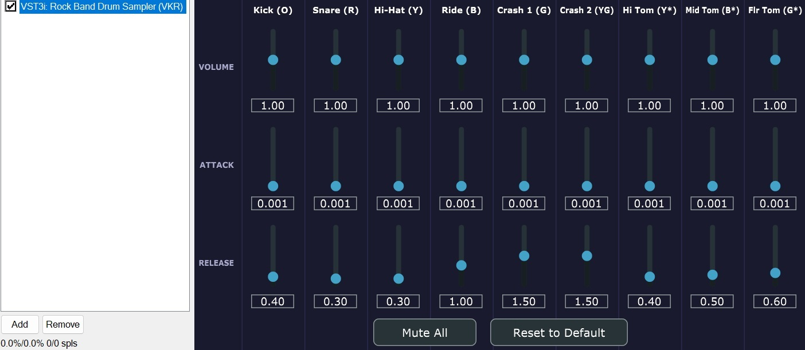

# RB Drum Sampler

**A VST3 plugin for previewing and testing Rock Band drum charts inside a DAW.** Add it as an instrument on your `PART DRUMS` MIDI track and play back the chart — every kick, snare, hi-hat, cymbal, and tom hit fires a real audio sample so you can hear exactly how the chart will feel to play.

This is a **charting aid**, not a replacement for in-game audio. The goal is to give you accurate audio feedback while you author and refine a `PART DRUMS` chart — including the tom-marker logic and double-crash combos that are easy to get wrong when you can only see MIDI notes on a piano roll.



---

## Requirements

- A **VST3-capable DAW** (REAPER, Ableton Live, Bitwig, etc.) with a `PART DRUMS` MIDI track to preview
- Nine OGG audio samples in the `audio/` folder (required at build time — see [Audio samples](#audio-samples))

The plugin is VST3 only.

---

## Installation

1. Download `RBDrumSampler.vst3` from the [GitHub Releases](../../releases) page. (If no prebuilt release is available, or you want the latest, see [Building from source](#building-from-source).)
2. Copy `RBDrumSampler.vst3` into your VST3 folder — on Windows that is `C:\Program Files\Common Files\VST3`.
3. Rescan plugins in your DAW, or restart it.
4. Add **RB Drum Sampler** as an instrument on a MIDI track (see [Setting up the plugin](#setting-up-the-plugin)).

---

## Quick start

1. Open the DAW project containing the drum chart you want to preview.
2. Add **RB Drum Sampler** as an instrument on your `PART DRUMS` MIDI track.
3. Press play — each note in the chart fires its corresponding sample in real time.

No configuration is needed. The plugin reads the standard `PART DRUMS` note numbers (96–112) and handles all remapping internally.

---

## Setting up the plugin

### Adding the plugin to your chart track

Open your DAW project and find the `PART DRUMS` MIDI track that holds the drum chart. Add **RB Drum Sampler** as an instrument (not an FX insert) on that track. The plugin receives the track's MIDI events, generates audio, and outputs stereo — route it through your DAW's mixer like any other instrument.

That is all that is needed. Press play and the chart drives the samples directly.

### Working in REAPER

REAPER is the primary DAW for Rock Band charting. The workflow is the same as above: add the plugin as an instrument on the `PART DRUMS` track. Because REAPER reuses the same track output for both monitoring and playback, you hear the samples whether you are playing back existing MIDI or recording new notes in real time.

---

## Controls

Each of the nine drums (Kick, Snare, Hi-Hat, Ride, Crash 1, Crash 2, Hi Tom, Mid Tom, Floor Tom) has three sliders:

| Slider | Range | Default | What it does |
| ------- | ----- | ------- | ------------ |
| **Volume** | 0.0–2.0 | 1.0 | Scales the drum's output level. 1.0 = unity gain, 0.0 = silent, 2.0 = double. |
| **Attack** | 0–500 ms | ~1 ms | Fade-in time at the start of each hit. 0 ms is normal for drums; higher values soften the initial transient. |
| **Release** | 10 ms–3 s | varies | Fade-out time after the hit. Low = tight/dry (cuts the sample short); high = lets it ring naturally. |

Two buttons sit above the sliders:

- **Mute All** — silences all drums without moving any sliders. The button turns red while active. Its state is **not** saved with the project and resets to off on every load.
- **Reset to Default** — restores all volume, attack, and release sliders to their factory values.

All slider values are saved with your DAW project and restored on reload. Mute All is the only exception.

---

## MIDI note scheme

The plugin understands the standard Rock Band `PART DRUMS` note numbers. These correspond to the **Expert difficulty** lane only — notes from other lanes (Easy: 60–64, Medium: 72–76, Hard: 84–88) are not mapped and produce no sound.

| RB note | Default sound     | Overridden by                        |
| ------- | ----------------- | ------------------------------------ |
| 96      | Kick              | —                                    |
| 97      | Snare             | —                                    |
| 98      | Hi-hat (closed)   | Tom marker 110 → Yellow Tom; Y+G combo → Crash 2 |
| 99      | Ride (blue cymbal)| Tom marker 111 → Blue Tom            |
| 100     | Crash 1 (green cymbal) | Tom marker 112 → Green Tom      |
| 110     | *(silent marker)* | Signals yellow cymbal → tom mode     |
| 111     | *(silent marker)* | Signals blue cymbal → tom mode       |
| 112     | *(silent marker)* | Signals green cymbal → tom mode      |

### Tom markers (110–112)

Rock Band distinguishes cymbal hits from tom hits by sending a silent **tom marker** note (110, 111, or 112) alongside the cymbal note in the same MIDI block. When the plugin sees a marker alongside its corresponding cymbal note, it plays the tom sample instead of the cymbal. The marker notes themselves produce no audio.

### Y+G combo crash

When notes 98 (yellow) and 100 (green) arrive in the same MIDI block **without** their respective tom markers, the plugin treats this as a simultaneous double-crash hit and plays **Crash 2** on note 98 instead of the hi-hat. This matches Rock Band's own double-crash notation.

### Note-offs

Note-offs for all drum pitches (96–112) are intentionally ignored. Rock Band sends note-offs almost immediately after note-ons (~0.05 s), which would cut samples short. Voices decay naturally.

---

## Audio samples

Nine OGG files must be placed in the `audio/` directory **before** configuring CMake — they are embedded in the binary at build time and are not loaded from disk at runtime.

| File             | Triggered by                        |
| ---------------- | ----------------------------------- |
| `Kick1.ogg`      | MIDI 96 (kick)                      |
| `Snare1.ogg`     | MIDI 97 (snare)                     |
| `HhClosed.ogg`   | MIDI 98 — default (hi-hat)          |
| `Ride1.ogg`      | MIDI 99 — default (blue cymbal)     |
| `Crsh1.ogg`      | MIDI 100 — default (green cymbal)   |
| `Crsh2.ogg`      | MIDI 101 — Y+G double crash         |
| `HiMidTom.ogg`   | MIDI 110 — tom override (yellow)    |
| `LoMidTom.ogg`   | MIDI 111 — tom override (blue)      |
| `LowFlrTom.ogg`  | MIDI 112 — tom override (green)     |

Bring your own samples. Any OGG file at the right path will work — replace the defaults with whatever kit sounds you prefer. After swapping files, reconfigure and rebuild.

---

## Troubleshooting

**No sound during playback.**
Check in order: (1) the plugin is on an **instrument** track, not an FX track; (2) the track is not muted and its output is routed to a live audio output; (3) the MIDI items on the track actually contain notes in the 96–112 range — other note numbers are silently ignored. Most DAWs show a MIDI activity indicator on the track; confirm it flickers during playback.

**All hits sound like cymbals — no toms.**
Tom mode is driven by the silent marker notes (110–112) arriving in the same audio block as the cymbal notes. If your MIDI source has very high latency or is batching events, markers and cymbal notes may land in different blocks. Try reducing your DAW's audio buffer size.

**The Y+G double crash plays hi-hat instead of the crash.**
Same cause as above — 98 and 100 must arrive in the same audio block. Lower the buffer size, or check whether your game's MIDI output is adding artificial delay between simultaneous notes.

**Sound cuts off too soon after each hit.**
Note-offs are suppressed, so this should not happen unless the voice pool is exhausted. The plugin has 16 voices shared across all nine sounds; a very dense passage could trigger voice stealing. This is unlikely in normal play but possible in rapid hi-hat runs. No configuration knob is exposed — if it is a persistent problem, the voice count can be raised in source.

**The plugin does not appear in my DAW after installation.**
Confirm the `.vst3` file was copied to `C:\Program Files\Common Files\VST3` (not inside a sub-folder), then trigger a full rescan in your DAW's plugin preferences.

---

## Building from source

Prerequisites: CMake ≥ 3.22, Visual Studio (MSVC), Git.

```powershell
# Configure — downloads JUCE 7.0.12 via CPM on first run (takes a few minutes)
cmake -B build -S .

# Build Release
cmake --build build --config Release

# Or Debug
cmake --build build --config Debug
```

The compiled VST3 lands in `build/RBDrumSampler_artefacts/`. Copy the `.vst3` bundle to `C:\Program Files\Common Files\VST3` and rescan in your DAW.

All nine OGG files in `audio/` must exist before running `cmake -B build`. CMake will error if any are missing.

---

## License

The original source code of this project is licensed under the **MIT License** — see [LICENSE](LICENSE).

The plugin is built with **JUCE** and the **Steinberg VST3 SDK**, which are dual-licensed under GPLv3 or a commercial license. Under the free/open-source path used here, a distributed binary links those frameworks and is therefore subject to the GPLv3. The MIT grant covers this project's own code, not the bundled third-party frameworks — see the third-party notice in [LICENSE](LICENSE) for details.
